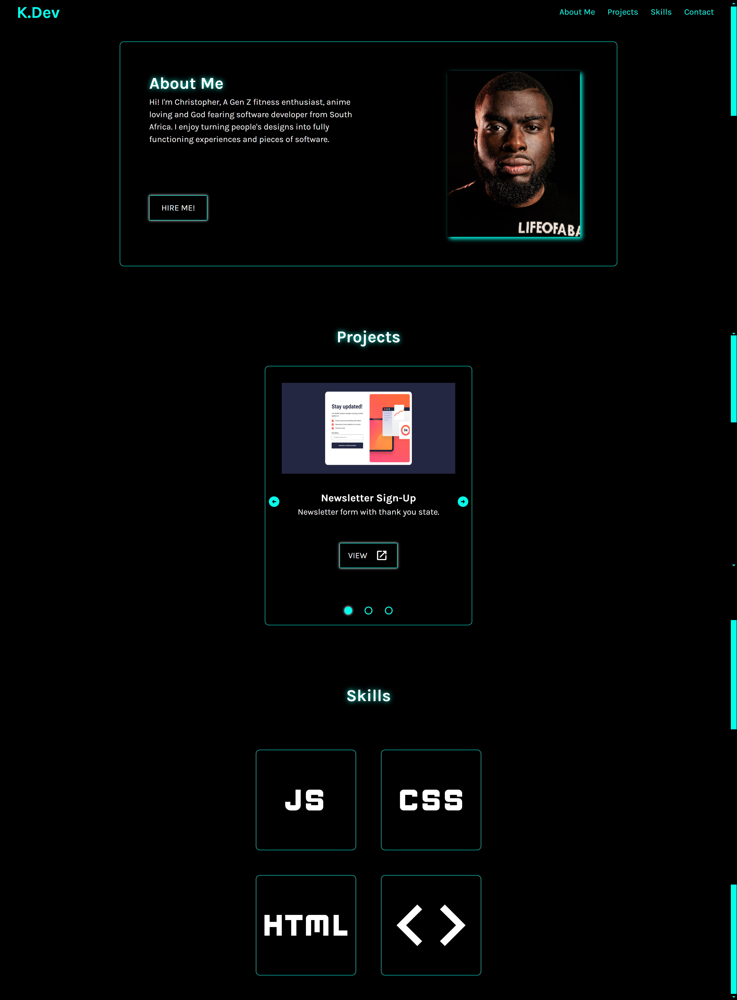
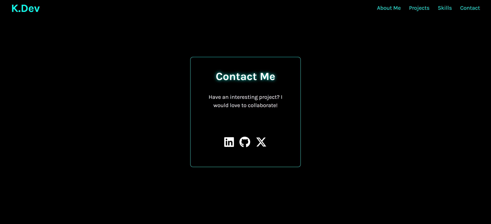
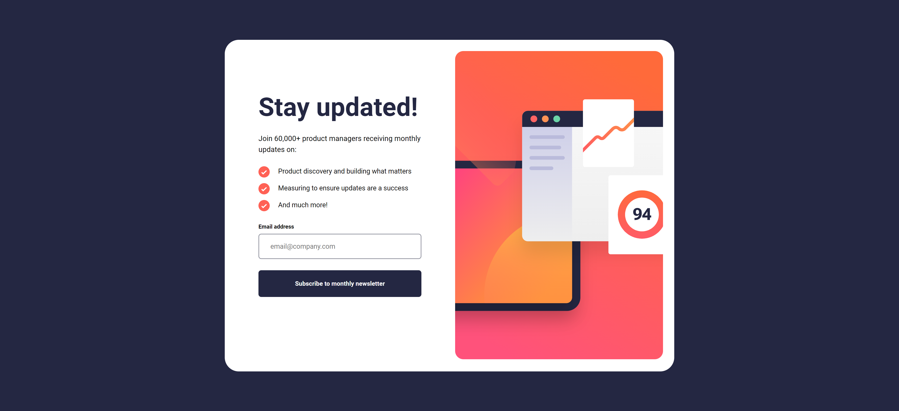
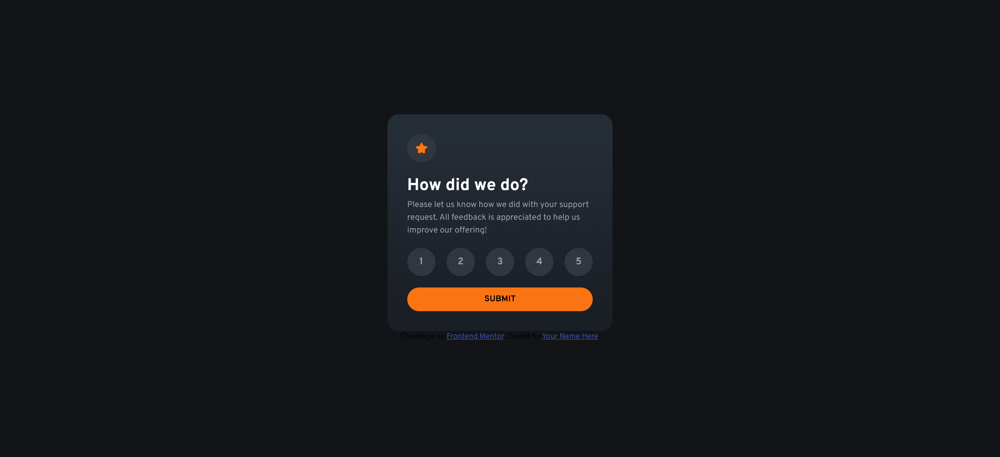
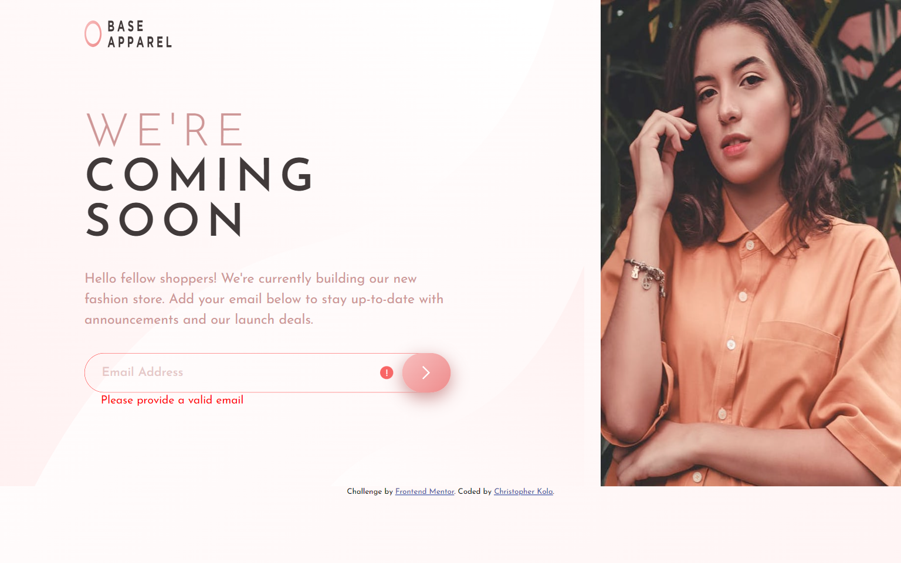

# Frontend Mentor - Recipe page solution

This repo contains a simple and very basic mock portfolio for CodeCademy fullstack course.

## Table of Contents

- [Overview](#overview)
  - [The challenge](#the-challenge)
  - [Screenshot](#screenshot)
  - [Links](#links)
- [My process](#my-process)
  - [Built with](#built-with)
  - [What I learned](#what-i-learned)
  - [Continued development](#continued-development)
  - [Useful resources](#useful-resources)
- [Author](#author)
- [Acknowledgments](#acknowledgments)

## Overview

### Screenshot

#### Desktop view



### Links

- Live Site URL: [Live site URL here]( https://ckola99.github.io/codeCademy-portfolio-site/)

## My process

### Built with

- Semantic HTML5 markup
- CSS custom properties
- Javascript

### What I learned

I learned how to code a functional carousel using html, css and javascript.

```html

<div class="carousel-container">
					<div class="slider">
						<div class="project">
							
							<h3
								class="project-title"
							>
								Newsletter
								Sign-Up
							</h3>
							<p
								class="project-description"
							>
								Newsletter form
								with thank you
								state.
							</p>
							<a
								href="https://ckola99.github.io/newsletter-sign-up/"
								target="_blank"
							>
								<button
									class="link"
								>
									view
									<span
										class="material-icons"
									>
										open_in_new
									</span>
								</button>
							</a>
						</div>
						<div class="project">
							
							<h3
								class="project-title"
							>
								Interactive
								Rating Component
							</h3>
							<p
								class="project-description"
							>
								Interactive
								rating component
								with thank you
								state.
							</p>
							<a
								href=" https://ckola99.github.io/Interactive-rating-component/"
								target="_blank"
							>
								<button
									class="link"
								>
									view
									<span
										class="material-icons"
									>
										open_in_new
									</span>
								</button>
							</a>
						</div>
						<div class="project">
							
							<h3
								class="project-title"
							>
								Base Apparel
								Coming Soon Page
							</h3>
							<p
								class="project-description"
							>
								Coming soon page
								of Base Apparel
							</p>
							<a
								href="https://ckola99.github.io/coming-soon-page/"
								target="_blank"
							>
								<button
									class="link"
								>
									view
									<span
										class="material-icons"
									>
										open_in_new
									</span>
								</button>
							</a>
						</div>
					</div>
					<div class="controls">
						<span
							class="arrow left material-icons"
						>
							arrow_circle_left
						</span>
						<span
							class="arrow right material-icons"
						>
							arrow_circle_right
						</span>
						<ul>
							<li
								class="selected"
							></li>
							<li></li>
							<li></li>
						</ul>
					</div>
				</div>

```

``` javascript


const slider = document.querySelector('.slider');
const leftArrow = document.querySelector('.left');
const rightArrow = document.querySelector('.right');
const projects = document.querySelectorAll('.project');
const indicatorParents = document.querySelector('.controls ul');

let sectionIndex = 0;
const totalProjects = projects.length;
const shiftPercentage = 100 / totalProjects; // Calculate width percentage

// Function to update the slider position and the selected indicator
const updateSlider = (newIndex) => {
    sectionIndex = newIndex;
    document.querySelector('.controls .selected').classList.remove('selected');
    indicatorParents.children[sectionIndex].classList.add('selected');
    slider.style.transform = 'translateX(' + (sectionIndex * -shiftPercentage) + '%)';
};

// Add click event listeners to each indicator
document.querySelectorAll('.controls li').forEach((indicator, ind) => {
    indicator.addEventListener('click', () => updateSlider(ind));
});

// Add click event listener to the right arrow
rightArrow.addEventListener('click', () => {
    const newIndex = sectionIndex < totalProjects - 1 ? sectionIndex + 1 : sectionIndex;
    updateSlider(newIndex);
});

// Add click event listener to the left arrow
leftArrow.addEventListener('click', () => {
    const newIndex = sectionIndex > 0 ? sectionIndex - 1 : sectionIndex;
    updateSlider(newIndex);
});

document.addEventListener('scroll', () => {
    document.documentElement.style.scrollbarWidth = 'thin';
    document.body.style.overflowY = 'scroll';
});


```

### Continued development

I aim to start using react after this rehash of javascript and really push myself to create more interactive pages using the framework.

### Useful resources

- [Css reset](https://www.joshwcomeau.com/css/custom-css-reset/) - this article taught me about CSS reset and a little bit more about css defaults.
- [MDN](https://developer.mozilla.org/en-US/) - this website is what I used to make sure I used the correct selectors and available properties.
- [ChatGPT](https://chatgpt.com) - I used chatgpt for small queries about my code where I couldn't necessarily see issues.
- [Youtube](https://www.youtube.com/watch?v=rTB-UNl_B_Y&list=PLRCvSNiMyEmxBfXuFuQ70uxHcV9itxfTZ) - Where I learned how to make the carousel.

